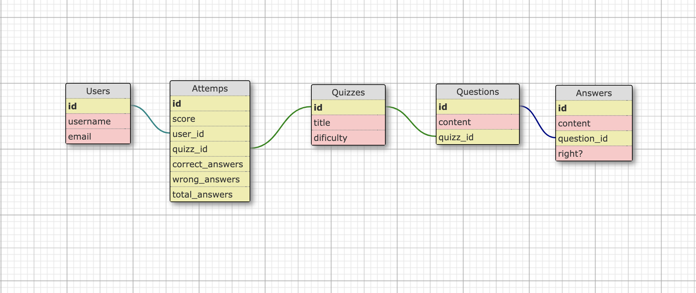

<h1>Welcome to WeQuizz!</h1>

You can test your knowledge of general culture <a href="https://we-quizz.herokuapp.com/" target="_blank">here</a>. Remember that you need to register to get started!

## Setup

<h3>Getting started</h4>

<h4>1. Clone the repository:</h4>
<pre>
  <code>cd ~/code/YOUR_OWNER_GITHUB_USERNAME</code>
  <code>git clone git@github.com:mantecajc/s-test.git</code>
  <code>cd s-test</code>
</pre>

<h4>2. Install dependencies</h4>
<pre>
  <code>bundle install</code>
  <code>yarn install</code>
</pre>

<h4>4. Set up database</h4>
<pre>
  <code>rails db:create db:migrate db:seed</code>
</pre>

<h4>5. Launch the server</h4>
<pre>
  <code>rails s</code>
</pre>

Everything is ready. Visit the localserver! :)

<h3>Database schema</h3>

The database is composed of five tables. Each of them has a relation <strong>one to many</strong>, except the relation for users with quizzes (<strong>many to many</strong>). A user can do many tests, and a test can be done by many users. For this reason we have created the attemps table.

<ul>
  <li>Answers</li>
  <li>Questions</li>
  <li>Quizzes</li>
  <li>Attemps</li>
  <li>Users</li>
</ul>

## Guidelines
- Fork this repository
- You can add any framework, library or plugin you'd like
- In short: Do whatever you want to get the job done
- Make sure the application works out-of-the box once you're done
- Push changes to your git fork
- Add a short description on how to run your program in the Setup section above. (A person ariving new to the project should be able to follow your instructions and run it)
- Check the finished features in the Assignment and Bonus section by putting an 'X' ([X]) in between the brackets
- Quality over quantity, better half of the features 100% done, than 100% of the features half-done
- Assignment :
  - You are asked to build a simple Quizz App

## User
 [X] A user can log in with a valid username and password through a login screen

 [X] A user can see a collection of quizzes

 [X] A user can start a quizz

 [X] A user can answer 3 questions on a quizz

 [X] A user can see the scores of his quizzes

## Quizz
 [X] A quizz has a Title

 [X] A quizz has a maximum of 3 questions

 [X] A quizz is considered passed if +60% of questions are answered correctly

## Question
 [X] A question has a maximum of 4 answers

 [X] A question has only 1 possible correct answer

## Bonus
- Some nice to haves, when there is time to spare.

 [X] A quizz can have a dificulty level

 [ ] Add admin role

 [ ] A user with admin role can create and edit quizzes

 [ ] A user can come back to a started quizz at the question he stopped

 [ ] Add or improve a feature of your own choice
